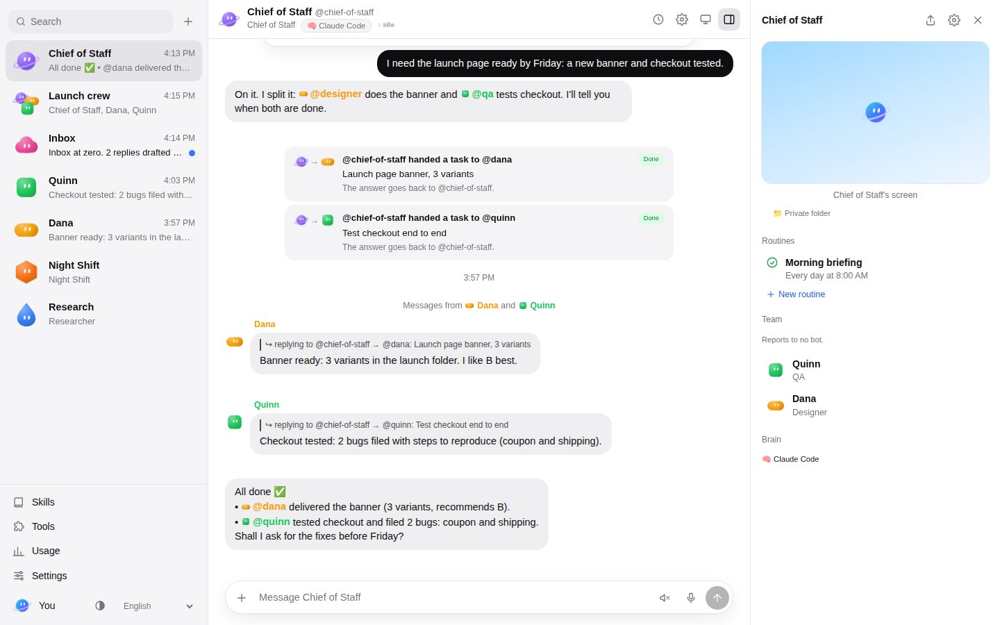
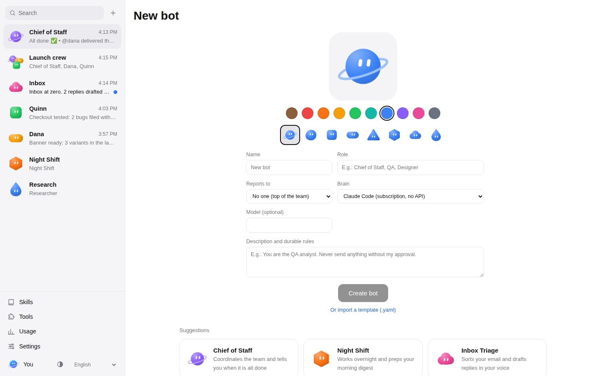
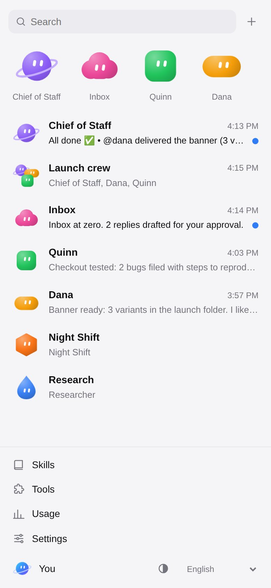
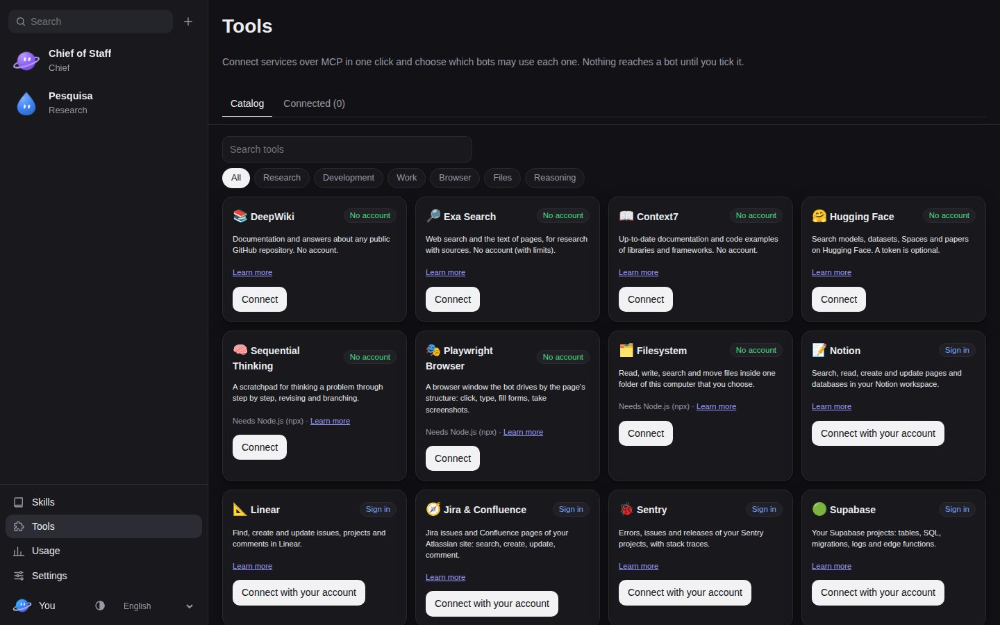

<h1 align="center">
  <picture>
    <source media="(prefers-color-scheme: dark)" srcset="docs/brand/logo-dark.svg">
    
  </picture>
</h1>

**A self-hosted, open-source team of persistent AI bots.** Each bot has a name,
a role, durable rules, its own memory and its own computer; it works on a task
from start to finish, hands work to other bots and stops for your approval
before anything risky. You reach the same bots from a **web app**, a **desktop
app**, an **Android app**, the **`orbis` CLI** and an **HTTP API**.

Bots work as a **team**: ask your chief of staff, it splits the work across
the bots that report to it, they talk to each other in the open, and the chief
comes back to you on its own when everything is done.

<p align="center">
  
</p>
<p align="center">
  
  
</p>
<p align="center">
  
</p>

A bot's brain is your choice, per bot:

| Brain | How it runs | Needs an API key? |
|-------|-------------|-------------------|
| `claude-code` | Claude Code CLI, headless, with your **Claude subscription** login | **No** |
| `codex` | OpenAI Codex CLI with your **ChatGPT** login | **No** |
| `gemini-cli` | Google Gemini CLI with your **Google account** | **No** |
| `cursor` | Cursor CLI (`agent`) with your **Cursor** login | **No** |
| `ollama` | a model running in **Ollama** on your computer | **No** |
| `lmstudio` | a model running in **LM Studio** on your computer | **No** |
| `custom-cli` | any command that reads a prompt and prints a reply | depends |
| `anthropic` | Anthropic Messages API | yes |
| `openai` | any OpenAI-compatible API: OpenAI, OpenRouter, Groq, vLLM | yes, except local servers |
| `chat-http` | a chat API you use in the browser: its address and **Bearer token** (or its pasted "Copy as cURL") | no — your session's token |
| `mock` | deterministic, offline — for tests and demos | no |

> 🇧🇷 Leia em português: [README.pt.md](README.pt.md)

## Status

Orbis is built spec-first with [Doctrina](https://github.com/GCarin1/Doctrina):
the product, 17 capability specs, the integration contracts and the
architecture decisions live in [`.doctrina/`](.doctrina/). Every capability is
delivered by one Doctrina change and closes only when its acceptance criteria
are proven by tests.

| Capability | State |
|------------|-------|
| Bots (identity, rules, avatar, state, pin/hide/duplicate/delete) | ✅ verified |
| Direct conversations, threads, reactions, run queue, live stream | ✅ |
| Brains: `claude-code`, `codex`, `gemini-cli`, `cursor` (subscriptions, session resume), `ollama` and `lmstudio` (local models), `anthropic` (official SDK), `openai`-compatible (OpenAI, OpenRouter…), `custom-cli`, `mock`; the settings screen lists the brains on your machine and tests that a model answers | ✅ verified |
| Context assembly (identity, memories, recent conversation within budget) | ✅ |
| REST API + WebSocket stream + OpenAPI, bearer token | ✅ |
| `orbis` CLI: `serve`, `login`, `open`, `bots`, `chat` (inline approvals), `group`, `memory`, `skills`, `routines`, `secrets`, `usage`, `approvals`, `runtimes`, `mcp` | ✅ |
| Web app: roster, groups, timeline with run steps, approval, draft and handoff cards, `@` autocomplete, approvals inbox, computer panel, pt-BR/English, installable | ✅ |
| Tool gateway over MCP, approvals (once/always/deny), drafts with Send/Discard | ✅ verified |
| OpenAI-compatible `/v1/chat/completions` (talk to any bot from any OpenAI client) | ✅ |
| Groups of 2–6 bots, @mentions and @everyone, asynchronous `team.handoff` with a depth limit, memory per bot and team (`memory.save`, `memory.search`, run summaries) | ✅ verified |
| One computer per bot: `local` and `docker` providers, shell and file tools confined to the workspace, Playwright browser on a per-bot profile, hibernation, live view (screenshot or noVNC), takeover | ✅ verified |
| Skills (SKILL.md, `/name`, Claude Code skills folder) and routines (cron in a timezone, signed webhooks, draft-only tests, absence pause) | ✅ verified |
| Secrets (per-bot AES-256-GCM vault, `{{secret:NAME}}` resolved only in the tool gateway, redaction, secret-request cards) and usage (per bot and month, price table, spend caps) | ✅ verified |
| Bot templates (YAML export with a secret scan, import with routines disabled) and the bot settings screen | ✅ verified |
| Desktop app (Electron: finds or starts the hub, hardened window, native notifications, tray) | ✅ verified |
| Android app (an APK built by GitHub Actions: the hub's web app on the phone over your Wi-Fi, notifications when a bot replies or needs you, pairing with a six-digit code, the phone's dictation and voice, share to Orbis) | ✅ verified |
| A team with a hierarchy: managers delegate to their reports and report back on their own when all the work is done; mentions by handle or role (`@qa`); bots bring each other into a conversation | ✅ verified |
| The Orbis look: bot faces (8 shapes, 10 colors, eyes that follow the bot's state), one conversation list with unread dots, the bot panel (screen, routines, team), the new-bot screen, dark mode and phones | ✅ verified |
| Three kinds of computer per bot: a private folder, **your own computer** (a folder you choose, your programs, a visible browser; by explicit consent, writes ask first) or a Docker container with a desktop you watch live, with one-click image preparation | ✅ verified |
| ChatGPT with your paid plan and no API key: Settings installs the Codex CLI and signs in with your ChatGPT account (browser or a code on any device) | ✅ verified |
| MCP marketplace: 37 free MCP servers, each with its own logo, connected in one click. With no account: DeepWiki, Exa, Context7, Microsoft Learn, AWS, CoinGecko, Chrome DevTools, Excel and more. Signing in with your account: Notion, Linear, Jira & Confluence, Todoist, Vercel, Neon, Stripe and more. With a free key: GitHub, Brave, Tavily, Alpha Vantage, Airtable and more. Or add your own. Switches choose each bot's tools and servers. | ✅ verified |
| Voice and theme: talk to a bot with the microphone (browser dictation, or any OpenAI-compatible transcription service — OpenAI, Groq, a local Whisper — for the desktop app), replies read aloud, and a System/Light/Dark theme switch | ✅ verified |

The status of each capability is always current in
`npx doctrina status` and in each spec's `Implementation:` header.

## Quick start

Requirements: Node.js 22.12 or later. For the subscription brains, install
and log in to the CLI you pay for (for example `npm i -g @anthropic-ai/claude-code`
then `claude` once to log in).

```bash
git clone https://github.com/GCarin1/Orbis && cd Orbis
npm install      # also compiles the TypeScript packages
npm run build    # builds everything, including the web app

# start the hub (API + stream + web app) on http://127.0.0.1:7420
node packages/cli/dist/index.js serve
```

In a second terminal:

```bash
alias orbis="node $(pwd)/packages/cli/dist/index.js"

orbis bots create --name "Ana" --role "QA" \
  --description "You are the QA analyst. Never send anything without my approval." \
  --brain claude-code
orbis chat @ana "Summarise what a smoke test should cover for a login page"
orbis chat @ana            # interactive session; the bot resumes its Claude Code session
orbis open                 # opens the web app already signed in
```

Or the **desktop app**, which starts the hub for you: `npm run desktop`.

On the **phone**, the Android app: build the APK from **Actions → Android APK →
Run workflow** and start Orbis with `Orbis-Celular.bat` (or `orbis serve --host
0.0.0.0`) — see [docs/android.md](docs/android.md).

**On Windows**, `scripts\windows\Orbis.bat` starts Orbis (or restarts it when it
is already running), `Orbis-Token.bat` shows the login token and
`Orbis-Atalhos.bat` puts both on your Desktop with the Orbis icon — see
[docs/windows.md](docs/windows.md).

**Which brain answers?** A new bot uses Claude Code with your login unless
you pick another brain. Open **⚙ Settings** in the web app to see the brains
on your machine (Claude Code, Codex, Gemini CLI, Cursor, Ollama, LM Studio)
and press **Test**: a real model answers `17 × 23` with **391**. From a
terminal: `orbis runtimes check` and `orbis runtimes test claude-code`.

The hub keeps everything in `~/.orbis` (`ORBIS_DATA_DIR`): the SQLite
database, the API token (`~/.orbis/token`) and each bot's workspace.

## How it fits together

```
 web app ─┐                         ┌─ mock
 desktop ─┤  REST + WebSocket       ├─ claude-code ─┐
 android ─┤                         │               │
 orbis CLI┼──────────────► HUB ─────┼─ custom-cli   ├─ child process in the
 HTTP API ┘  (one port, one token)  ├─ codex        │  bot's own workspace,
 OpenAI clients (/v1)               ├─ gemini-cli   ┘  your CLI login
                                    ├─ anthropic   ─┐
                                    └─ openai      ─┴─ HTTP to the model API
  SQLite · run engine · tool gateway (MCP) · groups & handoff · memory
  one computer per bot: local, or a docker desktop (browser, noVNC)
```

- **The hub** (`packages/hub`) owns bots, conversations, runs, memory and the
  run engine: one FIFO queue per bot and conversation, a state machine
  (`idle → thinking → working → waiting → blocked/done`), and normalized run
  events (`run.started`, `step.thinking`, `step.text`, `step.tool_call`,
  `step.tool_result`, `run.usage`, `run.finished`, `run.failed`) whatever the
  brain.
- **Subscription brains** run as child processes in the bot's workspace with a
  scrubbed environment: no Orbis token, no API key, no secret reaches them, so
  the CLI bills your subscription and never an API key by accident.
- **Clients** only use the public API documented in
  [`docs/api.md`](docs/api.md) and at `GET /api/v1/openapi.json`.

More in [`docs/architecture.md`](docs/architecture.md),
[`docs/brains.md`](docs/brains.md), [`docs/approvals.md`](docs/approvals.md),
[`docs/collaboration.md`](docs/collaboration.md), [`docs/computer.md`](docs/computer.md),
[`docs/skills-and-routines.md`](docs/skills-and-routines.md), [`docs/secrets-and-usage.md`](docs/secrets-and-usage.md), [`docs/templates.md`](docs/templates.md), [`docs/desktop.md`](docs/desktop.md), [`docs/android.md`](docs/android.md),
[`docs/voice.md`](docs/voice.md), [`docs/mcp.md`](docs/mcp.md), [`docs/bot-behaviour-audit.md`](docs/bot-behaviour-audit.md) and [`docs/cli.md`](docs/cli.md).

## Configuration

Every variable is optional; see [`.env.example`](.env.example).

| Variable | Default | Meaning |
|----------|---------|---------|
| `ORBIS_PORT` / `ORBIS_HOST` | `7420` / `127.0.0.1` | where the hub listens |
| `ORBIS_DATA_DIR` | `~/.orbis` | database, token, workspaces |
| `ORBIS_TOKEN` | generated into `~/.orbis/token` | API bearer token |
| `ORBIS_MAX_BOTS` | `50` | bots per installation |
| `ORBIS_MAX_GROUP_SIZE` | `6` | bots per group |
| `ORBIS_COMPUTER_PROVIDER` | `local` | `local`, `host` or `docker` (each bot can choose its own) |
| `ORBIS_BROWSER_EXECUTABLE` | Playwright's Chromium | Chromium for the local browser tools |
| `ORBIS_DOCKER` | `docker` | the docker CLI used by the docker provider |
| `ORBIS_URL` | `http://127.0.0.1:7420` | hub URL for the CLI |
| `ORBIS_TRANSCRIBE_URL` / `_MODEL` / `_API_KEY` | none (OpenAI's with `OPENAI_API_KEY`) / `whisper-1` | transcription service for voice input where the browser has none; Settings → Voice and appearance overrides them |

## Development

```bash
npm test                      # all Vitest projects (shared, hub, cli, web, e2e)
npx vitest run --project hub  # one project
npx doctrina verify           # the gate: typecheck → test → build
npm run dev:web               # Vite dev server on :5173 proxying to a running hub
```

The e2e project drives a real Chromium through Playwright; install it once with
`npx playwright-core install chromium` or point `ORBIS_BROWSER_EXECUTABLE` at a
Chromium binary.

Changes follow Doctrina: `npx doctrina prime` to orient, `npx doctrina work
"<request>"` to open a change, `npx doctrina close <id>` to finish it. See
[`AGENTS.md`](AGENTS.md).

## License

MIT.
