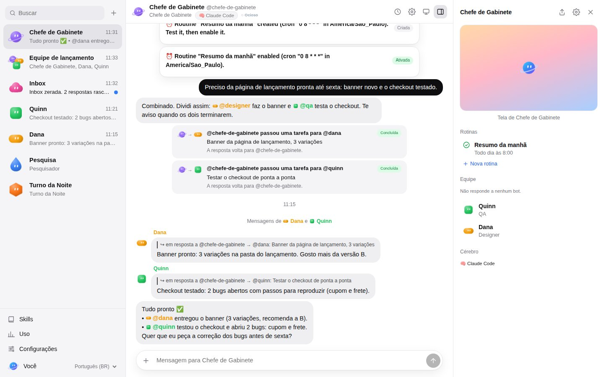
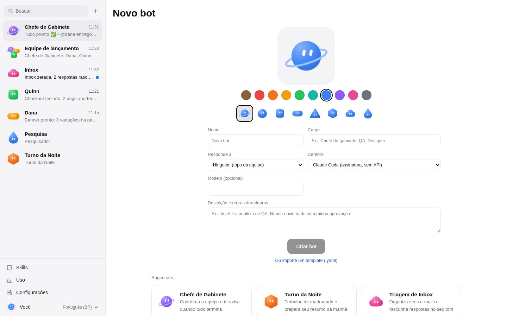
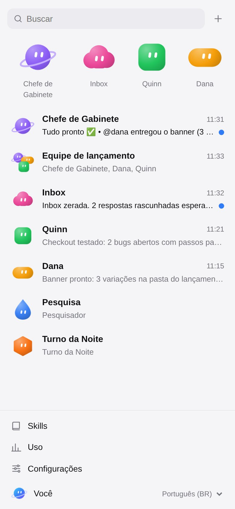

<h1 align="center">
  <picture>
    <source media="(prefers-color-scheme: dark)" srcset="docs/brand/logo-dark.svg">
    
  </picture>
</h1>

**Uma equipe de bots de IA persistentes, open source e auto-hospedada.** Cada
bot tem nome, cargo, regras duradouras, memória própria e computador próprio;
trabalha numa tarefa de ponta a ponta, passa trabalho para outros bots e para
pedindo sua aprovação antes de qualquer ação arriscada. Você fala com os mesmos
bots pelo **app web**, pelo **app desktop**, pela **CLI `orbis`** e pela **API
HTTP**.

Os bots trabalham como **equipe**: você pede ao seu chefe de gabinete, ele
divide o trabalho entre os bots que respondem a ele, eles conversam entre si à
vista de todos e o chefe volta até você sozinho quando tudo termina.

<p align="center">
  
</p>
<p align="center">
  
  
</p>

O cérebro de cada bot é escolha sua, bot a bot:

| Cérebro | Como roda | Precisa de chave de API? |
|---------|-----------|--------------------------|
| `claude-code` | Claude Code CLI, headless, com o login da sua **assinatura Claude** | **Não** |
| `codex` | OpenAI Codex CLI com o seu login do **ChatGPT** | **Não** |
| `gemini-cli` | Google Gemini CLI com a sua **conta Google** | **Não** |
| `cursor` | Cursor CLI (`agent`) com o seu login do **Cursor** | **Não** |
| `ollama` | um modelo rodando no **Ollama** no seu computador | **Não** |
| `lmstudio` | um modelo rodando no **LM Studio** no seu computador | **Não** |
| `custom-cli` | qualquer comando que lê um prompt e imprime a resposta | depende |
| `anthropic` | API Messages da Anthropic | sim |
| `openai` | qualquer API compatível com OpenAI: OpenAI, OpenRouter, Groq, vLLM | sim, exceto servidores locais |
| `mock` | determinístico, offline — para testes e demonstrações | não |

> 🇺🇸 Read in English: [README.md](README.md)

## Estado

O Orbis é construído com especificação primeiro, usando o
[Doctrina](https://github.com/GCarin1/Doctrina): o produto, 17 specs de
capacidade, os contratos de integração e as decisões de arquitetura ficam em
[`.doctrina/`](.doctrina/). Cada capacidade entra por uma change do Doctrina e só
fecha quando os critérios de aceite são provados por testes.

| Capacidade | Estado |
|------------|--------|
| Bots (identidade, regras, avatar, estado, fixar/ocultar/duplicar/apagar) | ✅ verificado |
| Conversas diretas, threads, reações, fila de execuções, stream ao vivo | ✅ |
| Cérebros: `claude-code`, `codex`, `gemini-cli`, `cursor` (assinaturas, retomam a sessão), `ollama` e `lmstudio` (modelos locais), `anthropic` (SDK oficial), `openai`-compatível (OpenAI, OpenRouter…), `custom-cli`, `mock`; a tela de Configurações lista os cérebros da sua máquina e testa se um modelo responde | ✅ verificado |
| Montagem de contexto (identidade, memórias, conversa recente dentro do orçamento) | ✅ |
| API REST + stream WebSocket + OpenAPI, token bearer | ✅ |
| CLI `orbis`: `serve`, `login`, `open`, `bots`, `chat` (aprovação inline), `group`, `memory`, `skills`, `routines`, `secrets`, `usage`, `approvals`, `runtimes`, `mcp` | ✅ |
| App web: roster, grupos, timeline com passos, cards de aprovação, rascunho e handoff, autocomplete de `@`, caixa de aprovações, painel do computador, pt-BR/inglês, instalável | ✅ |
| Gateway de ferramentas via MCP, aprovações (uma vez/sempre/negar), rascunhos com Enviar/Descartar | ✅ verificado |
| `/v1/chat/completions` compatível com OpenAI (fale com qualquer bot de qualquer cliente OpenAI) | ✅ |
| Grupos de 2 a 6 bots, @menções e @everyone, `team.handoff` assíncrono com limite de profundidade, memória por bot e da equipe (`memory.save`, `memory.search`, resumos de execução) | ✅ verificado |
| Um computador por bot: provedores `local` e `docker`, shell e arquivos confinados ao workspace, navegador Playwright com perfil próprio, hibernação, tela ao vivo (screenshot ou noVNC), assumir controle | ✅ verificado |
| Skills (SKILL.md, `/nome`, pasta de skills do Claude Code) e rotinas (cron com fuso horário, webhooks assinados, testes só-rascunho, pausa por ausência) | ✅ verificado |
| Segredos (cofre AES-256-GCM por bot, `{{secret:NOME}}` resolvido só no gateway de ferramentas, mascaramento, cards de pedido de segredo) e uso (por bot e mês, tabela de preços, teto de gasto) | ✅ verificado |
| Templates de bot (exportação YAML com varredura de segredos, importação com rotinas desativadas) e a tela de configurações do bot | ✅ verificado |
| App desktop (Electron: encontra ou inicia o hub, janela protegida, notificações nativas, bandeja) | ✅ verificado |
| Equipe com hierarquia: gestores delegam aos subordinados e prestam contas sozinhos quando tudo termina; menções por handle ou por função (`@qa`); bots chamam uns aos outros para a conversa | ✅ verificado |
| O visual do Orbis: rostos dos bots (8 formas, 10 cores, olhos que seguem o estado), uma lista de conversas com bolinha de não lida, o painel do bot (tela, rotinas, equipe), a tela de novo bot, modo escuro e celular | ✅ verificado |

O estado de cada capacidade está sempre atualizado em `npx doctrina status` e
no cabeçalho `Implementation:` de cada spec.

## Começando

Requisitos: Node.js 22.12 ou mais novo. Para os cérebros por assinatura,
instale e faça login na CLI que você já paga (por exemplo
`npm i -g @anthropic-ai/claude-code` e depois `claude` uma vez para logar).

```bash
git clone https://github.com/GCarin1/Orbis && cd Orbis
npm install      # também compila os pacotes TypeScript
npm run build    # compila tudo, inclusive o app web

# sobe o hub (API + stream + app web) em http://127.0.0.1:7420
node packages/cli/dist/index.js serve
```

Em outro terminal:

```bash
alias orbis="node $(pwd)/packages/cli/dist/index.js"

orbis bots create --name "Ana" --role "QA" \
  --description "Você é a analista de QA. Nunca envie nada sem minha aprovação." \
  --brain claude-code
orbis chat @ana "Liste o que um smoke test de tela de login deve cobrir"
orbis chat @ana            # sessão interativa; o bot retoma a sessão do Claude Code
orbis open                 # abre o app web já autenticado
```

Ou o **app desktop**, que inicia o hub para você: `npm run desktop`.

**Qual cérebro está respondendo?** Um bot novo usa o Claude Code com o seu
login, a menos que você escolha outro cérebro. Abra **⚙ Configurações** no app
web para ver os cérebros da sua máquina (Claude Code, Codex, Gemini CLI,
Cursor, Ollama, LM Studio) e clique em **Testar**: um modelo de verdade
responde `17 × 23` com **391**. No terminal: `orbis runtimes check` e
`orbis runtimes test claude-code`.

O hub guarda tudo em `~/.orbis` (`ORBIS_DATA_DIR`): o banco SQLite, o token da
API (`~/.orbis/token`) e o workspace de cada bot.

## Como as peças se encaixam

- **O hub** (`packages/hub`) cuida de bots, conversas, execuções, memória e do
  motor de execução: uma fila FIFO por bot e conversa, uma máquina de estados
  (`idle → thinking → working → waiting → blocked/done`) e eventos
  normalizados (`run.started`, `step.thinking`, `step.text`,
  `step.tool_call`, `step.tool_result`, `run.usage`, `run.finished`,
  `run.failed`), qualquer que seja o cérebro.
- **Cérebros por assinatura** rodam como processos filhos no workspace do bot
  com um ambiente limpo: nenhum token do Orbis, nenhuma chave de API e nenhum
  segredo chega até eles — a CLI cobra da sua assinatura, nunca de uma chave de
  API por acidente.
- **Os clientes** usam só a API pública documentada em
  [`docs/api.md`](docs/api.md) e em `GET /api/v1/openapi.json`.

Mais em [`docs/architecture.md`](docs/architecture.md),
[`docs/brains.md`](docs/brains.md), [`docs/approvals.md`](docs/approvals.md),
[`docs/collaboration.md`](docs/collaboration.md), [`docs/computer.md`](docs/computer.md),
[`docs/skills-and-routines.md`](docs/skills-and-routines.md), [`docs/secrets-and-usage.md`](docs/secrets-and-usage.md), [`docs/templates.md`](docs/templates.md), [`docs/desktop.md`](docs/desktop.md),
[`docs/mcp.md`](docs/mcp.md) e [`docs/cli.md`](docs/cli.md).

## Configuração

Todas as variáveis são opcionais; veja [`.env.example`](.env.example).

| Variável | Padrão | Significado |
|----------|--------|-------------|
| `ORBIS_PORT` / `ORBIS_HOST` | `7420` / `127.0.0.1` | onde o hub escuta |
| `ORBIS_DATA_DIR` | `~/.orbis` | banco, token, workspaces |
| `ORBIS_TOKEN` | gerado em `~/.orbis/token` | token bearer da API |
| `ORBIS_MAX_BOTS` | `50` | bots por instalação |
| `ORBIS_MAX_GROUP_SIZE` | `6` | bots por grupo |
| `ORBIS_COMPUTER_PROVIDER` | `local` | `local` ou `docker` |
| `ORBIS_BROWSER_EXECUTABLE` | Chromium do Playwright | Chromium das ferramentas de navegador locais |
| `ORBIS_DOCKER` | `docker` | a CLI do docker usada pelo provedor docker |
| `ORBIS_URL` | `http://127.0.0.1:7420` | URL do hub para a CLI |

## Desenvolvimento

```bash
npm test                      # todos os projetos do Vitest (shared, hub, cli, web, e2e)
npx vitest run --project hub  # um projeto
npx doctrina verify           # o gate: typecheck → test → build
npm run dev:web               # Vite em :5173 fazendo proxy para um hub rodando
```

O projeto e2e usa um Chromium real via Playwright; instale uma vez com
`npx playwright-core install chromium` ou aponte `ORBIS_BROWSER_EXECUTABLE`
para um binário do Chromium.

As mudanças seguem o Doctrina: `npx doctrina prime` para se orientar,
`npx doctrina work "<pedido>"` para abrir uma change, `npx doctrina close <id>`
para fechá-la. Veja o [`AGENTS.md`](AGENTS.md).

## Licença

MIT.
